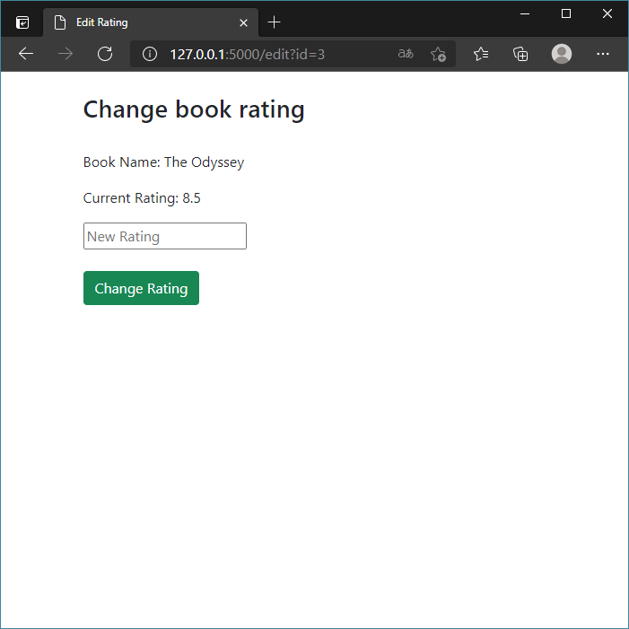

# CRUD operations of a library

In this application, you can register and delete books, in addition to changing their rating.

Languages and frameworks I used: Python, Flask, SQLAlchemy, HTML & Bootstrap.

